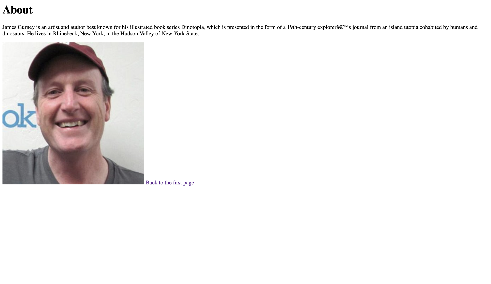

Visit a site using The Wayback Machine, looking at a snapshot at least 10 years old. Where did you go? What did it look like? How has it changed?

Answer: I checked out yahoo.com but went as far back as I could. It's funny because it honestly looks a lot more usable in my oppinion than google.

Summarize your experience with these last few topics. What did you learn? What was difficult, easy, or still misunderstood?

Answer: I solidified my HTML coding skills as well as implimented further practice. Not hard but good review!

An embedded image of your screenshot using its relative URL.
      
